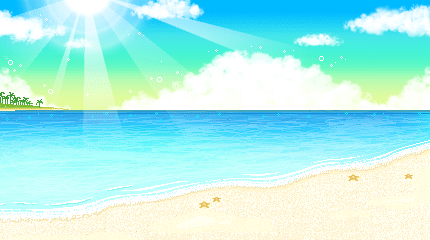
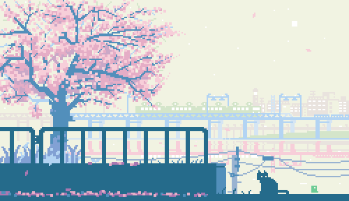

# **⌚ Relogio Digital**

Colaboração em desenvolvimento parceiro.

end

Projeto de um relógio digital em que se influencia no background dependente do horário atual.

 

## 📜 Status
> Status: in development aid

## 💻 Funcionalidades

> * Visualização nas horas, minutos e segundos
> * background modular dependente das horas atual

<!-- ## 👀 Preview
 
> 
> 
> 
> ### Gif
>  -->

 
 
 

  👇

 

###  **🔗 Links e autorias**

 

> <a href="https://github.com/filipelimavaz"><b> Filipe de Lima </b></a>
> e
> <a href="https://github.com/IsaacGSS"><b> Isaac S. Silva </b></a> :
>  
> <q>Obrigado a todos os artistas que contribuiram nesse meu projeto de estudos > </q>

 

## **img**

 ### <a href="https://weheartit.com/entry/182008200">**Morning**: 

  </a>

 

 ### <a href="https://tenor.com/view/trees-windy-cat-relax-nature-gif-15821326">**Day**:

  </a>

 

 ### <a href="https://br.pinterest.com/pin/74802043802214365/">**Sunset**: 
  </a>

 

 ### <a href="https://br.pinterest.com/pin/633459503841300051/">**Night**:
  </a>
