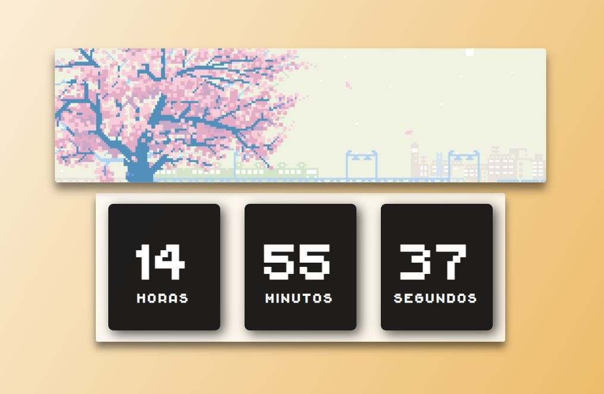

# **⌚ Relogio Digital**

Colaboração em desenvolvimento parceiro.

Projeto de um relógio digital em que se influencia no background dependente do horário atual.

 

## 📜 Status
> Status: in development aid

## 💻 Funcionalidades

> * Visualização nas horas, minutos e segundos
> * background modular dependente das horas atual

###  **🔗 Links e autorias**

 

> <a href="https://github.com/filipelimavaz"><b> Filipe de Lima </b></a>
> e
> <a href="https://github.com/IsaacGSS"><b> Isaac S. Silva </b></a> :
>  
> <q>Obrigado a todos os artistas que contribuiram nesse meu projeto de estudos > </q>

 
<a href="https://github.com/IsaacGSS/relogio_digital/blob/main/md/linkEAutoria.md" ><b>Link e Autoria.md<b></a>

## 👀 Preview
 
> 
> 
> 
> 
> 
> ### Gif
> 
